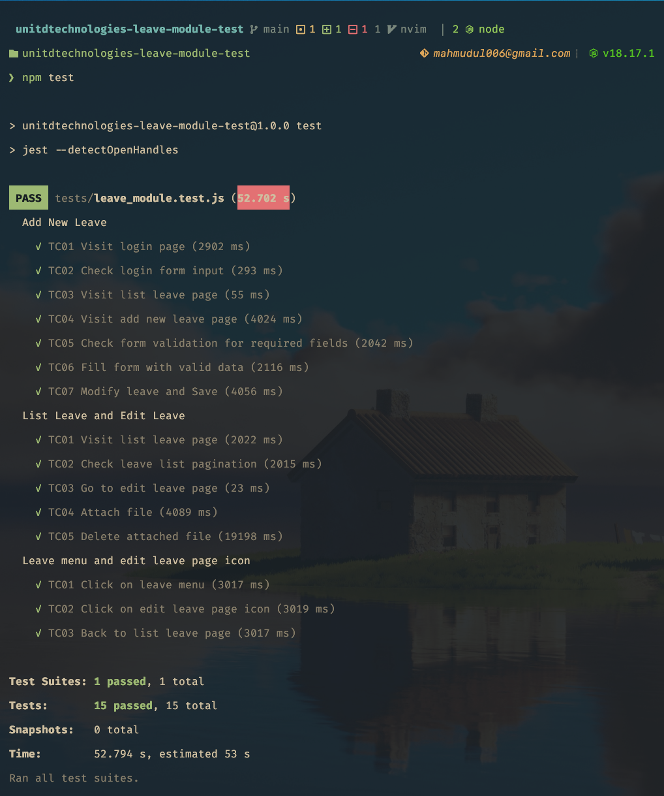

# How to start the project

### Requirements
- Setup google chrome web driver

```sh
npm install
npm test
```

### Generate report
```sh
npx allure-commandline serve
```

> Make sure to delete the allure-results folder

### Test report screenshot



## Todo
- [x] Click on leave page
- [x] Delete operation
- [x] Edit icon click from the list page
